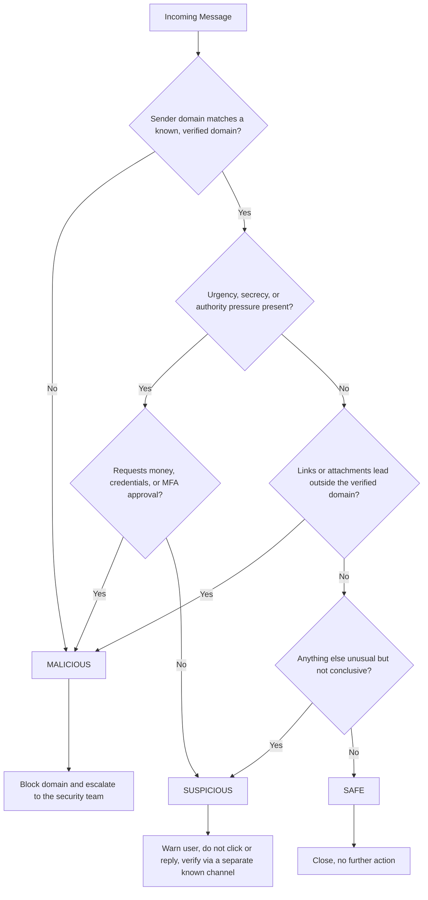

# Project 3 — Phishing Awareness Analysis
**DecodeLabs Cybersecurity Internship · Batch 2026 · Detection Phase**

**Prepared by:** [Your Name]
**Role:** Cybersecurity Analyst (Intern)

This deliverable covers everything Project 3 asks for: analysis of sample messages (suspicious links/keywords, red flags, why each is unsafe), a non-expert red-flag checklist, and a triage decision tree with defined actions.

> **A note on the samples below:** every message is fictional, built for this exercise. Malicious links are "defanged" (`hxxp://` instead of `http://`) — standard practice in security write-ups so nothing is live or accidentally clickable.

---

## 1. Methodology

Five simulated messages were built to cover the delivery channels from the training material — mass email, spear-phishing/BEC, smishing, and callback vishing (TOAD) — plus one legitimate internal email as a control, so the checklist has a clear "what normal looks like" baseline. Each sample is read through the same three-part lens used throughout the training:

- **Input (the bait):** who it claims to be from, and how it was delivered
- **Process (the psychology):** which cognitive trigger it leans on — authority, urgency, curiosity, or fear/greed
- **Output (the verdict):** Safe, Suspicious, or Malicious, and the action that follows

---

## 2. Sample Analysis

### Sample 1 — Mass Phishing: Fake Account Suspension

```
From:    Amazon Support <support@amaz0n-security.com>
To:      user@example.com
Subject: Urgent: Your Account Has Been Suspended

Dear Customer,

We have detected unusual activity on your account. Your account 
has been temporarily suspended for security reasons.

To restore access, please verify your information immediately:
hxxp://amaz0n-account-verify.com/login

Failure to verify within 24 hours will result in permanent 
account closure.

Regards,
Amazon Security Team
```

**Suspicious links/keywords:** `amaz0n-security.com`, `amaz0n-account-verify.com` (zero substituted for "o"), "verify your information immediately," "24 hours," "permanent account closure"

**Red flags:**
- Typosquatted sender domain — not amazon.com
- Generic greeting ("Dear Customer") instead of a name, typical of a high-volume, low-personalization lure
- Urgency + fear stacked together (countdown, threat of permanent loss)
- Link destination doesn't match the brand it claims to be

**Why it's unsafe:** The link leads to a look-alike login page built to harvest credentials. A real Amazon notice would never come from a misspelled domain or threaten permanent closure inside 24 hours.

**Verdict: 🔴 Malicious → Block Domain & Escalate**

---

### Sample 2 — Spear-Phishing / BEC: The Wire Transfer Request

```
From:     Robert Hayes (CEO) <r.hayes@decodelabs-corp.com>
Reply-To: r.hayes.ceo@gmail.com
To:       Priya Sharma (Finance) <priya.sharma@decodelabs.tech>
Subject:  URGENT - Confidential Wire Transfer

Priya,

I'm in a closed-door meeting with our Singapore acquisition 
partners and can't talk. Process an urgent wire transfer of 
$48,500 to our new vendor's account before 4 PM today — details 
attached.

This is time-sensitive and strictly confidential. Please don't 
loop in anyone else, including [Finance Manager], until it's 
done. I'll explain when I'm back.

Thanks,
Robert
[Attachment: Wire_Instructions.pdf]
```

**Suspicious links/keywords:** lookalike sender domain, mismatched Reply-To, "strictly confidential," "don't loop in anyone else," hard same-day deadline

**Red flags:**
- From-domain (`decodelabs-corp.com`) is a lookalike for the real company domain (`decodelabs.tech`) — and Reply-To routes to a personal Gmail account, so even a reply never reaches anyone at the real company
- Secrecy demand plus an explicit instruction to bypass a named colleague — a textbook urgent-bypass request
- Executive authority + urgency, timed to close before end of business
- A specific but unverifiable detail ("Singapore acquisition") — the kind of contextual precision spear-phishing uses to feel credible

**Why it's unsafe:** This is a classic Business Email Compromise pattern. The secrecy instruction exists to block the one step that would catch it: a phone call to Robert's actual, known number.

**Verdict: 🔴 Malicious → Block Domain & Escalate** *(verify any such request through a separate, known channel before acting — never the contact info in the message itself)*

---

### Sample 3 — Smishing: Fake Customs Fee

```
FedEx: Your package is on hold - unpaid customs fee of $2.99.
Pay now to avoid return to sender:
hxxp://fedex-tracking-pay.info/pkg8827
Reply STOP to opt out.
```

**Suspicious links/keywords:** `fedex-tracking-pay.info` (not a FedEx domain), an unusually small fee, "on hold," "avoid return to sender"

**Red flags:**
- Combosquatted domain — shipping-related words bolted onto an unrelated root
- Deliberately tiny amount, designed to feel too small to question
- Delivered by SMS, a channel with no spam filtering and a screen too small to show the full URL
- No real tracking-number format, just a short generic reference

**Why it's unsafe:** The link leads to a payment page built to harvest card details, not FedEx. The trivial fee is the trick — people who'd never wire $500 will "pay" $2.99 without a second thought.

**Verdict: 🔴 Malicious → Block Domain & Escalate**

---

### Sample 4 — Callback Phishing (TOAD): Subscription Renewal

```
Subject: Microsoft 365 Subscription — Payment Overdue

Your Microsoft 365 subscription payment failed to process.
To avoid service cancellation, call 1-800-XXX-XXXX IMMEDIATELY.

Order #: 900125033233
Amount: $190.60
```

**Suspicious links/keywords:** no link at all, only a phone number; a generic-looking order number; "IMMEDIATELY"

**Red flags:**
- No URL to inspect — that's deliberate. It's built to slip past link and attachment scanners entirely
- The real attack happens on the call: the "support agent" impersonates Microsoft, spoofs caller ID, and talks the victim through reading out a card number or installing remote-access software
- Urgency around losing a service, paired with a specific-looking but unverifiable order number

**Why it's unsafe:** Because there's nothing to click, an automated scan may wave this through. That gap is exactly what TOAD (Telephone-Oriented Attack Delivery) is built to exploit — which is why it needs a human to pause and verify rather than being auto-cleared.

**Verdict: 🟡 Suspicious → Warn User** *(don't call the number in the message — look up the real billing support line independently if there's a genuine concern)*

---

### Sample 5 — Control Sample: Legitimate Internal Email

```
From:    Aisha Khan (HR) <aisha.khan@decodelabs.tech>
To:      All Staff <allstaff@decodelabs.tech>
Subject: Reminder: Submit Timesheets by Friday

Hi all,

Friendly reminder to submit timesheets for this pay period by 
end of day Friday, through the usual HR portal 
(hr.decodelabs.tech).

No action needed if you've already submitted. Reach out directly 
if you have questions.

Thanks,
Aisha
```

**Why it's safe:**
- Sender domain matches the company domain consistently — and so does the linked portal
- No urgency, secrecy, or authority pressure
- No request for credentials, payment, or MFA
- Named, identifiable sender, reachable through normal channels

**Verdict: 🟢 Safe → Close** *(no further action)*

---

## 3. Red Flag Checklist (Non-Expert Reference)

**Sender & Header**
- [ ] Display name and the actual email domain match
- [ ] Domain is spelled exactly right — watch for `0` instead of `o`, `rn` instead of `m`, or extra words like "-secure," "-verify," "-login"
- [ ] Reply-To matches From — a mismatch is a strong warning sign
- [ ] No pasted forwarding chains or timestamps that don't add up

**Language & Psychology**
- [ ] No artificial urgency ("act within 30 minutes," "account locked today")
- [ ] No authority pressure demanding unquestioned compliance (fake CEO, IT, or law enforcement)
- [ ] No request to keep it secret or skip a colleague/approval step
- [ ] No reward or threat that feels out of step with how this sender normally communicates

**Links & Attachments**
- [ ] Preview the real destination before clicking (hover on desktop, long-press on mobile)
- [ ] Read unfamiliar domains right-to-left to find the true root — in `login.company.free-host.com`, the real domain is `free-host.com`
- [ ] No uncommon attachment types (`.iso`, `.js`, `.scr`, `.html`) from unexpected senders
- [ ] No unsolicited QR code asking you to "scan to secure" or "scan to verify"

**Requests**
- [ ] No request for passwords, MFA codes, or payment details over email or text
- [ ] Any payment or wire request goes through the normal approval steps — no exceptions, ever
- [ ] No repeated, unprompted MFA push notifications

**Channel-Specific**
- [ ] SMS: an unexpected delivery or bank alert with a link
- [ ] Voice: a callback number in a text or email instead of a real, published support line
- [ ] Video/voice calls: something feels slightly "off" about a familiar face or voice making an urgent, ad-hoc request

---

## 4. Triage Decision Tree



| Step | Question | If Yes | If No |
|---|---|---|---|
| 1 | Sender domain exactly matches the real, known domain? | Go to Step 2 | **MALICIOUS** |
| 2 | Urgency, secrecy, or authority pressure present? | Go to Step 3 | Go to Step 4 |
| 3 | Requests money, credentials, or MFA approval? | **MALICIOUS** | **SUSPICIOUS** |
| 4 | Links/attachments lead outside the verified domain? | **MALICIOUS** | Go to Step 5 |
| 5 | Anything else unusual (generic greeting, odd formatting, unexpected attachment)? | **SUSPICIOUS** | **SAFE** |

**Actionable outcomes:**
- **Safe → Close.** No further action; resume normal work.
- **Suspicious → Warn User.** Don't click, reply, call the listed number, or pay. Verify through a separate, known channel — e.g., the extension in the company directory, not the number in the message.
- **Malicious → Block Domain & Escalate.** Report through the internal reporting tool rather than deleting. Deleting clears your inbox; reporting lets the security team purge it from everyone else's.

This operationalizes the golden rule from the training: **Pause → Verify → Report.**

---

## 5. Bonus: Spotting Hidden Destinations

- **Link text is not the same as the link destination.** Always preview before clicking.
- **Read right-to-left.** In a nested domain like `accounts.decodelabs.tech.login-update.com`, the true owner is `login-update.com` — everything before it is a fake-looking subdomain designed to bury the real root.
- **URL shorteners hide the destination on purpose.** A `bit.ly`- or `tinyurl`-style link in an unsolicited message should be treated as suspicious until expanded with a preview tool. Never enter credentials on a page reached through a shortened link from an unknown sender.

---

## 6. Conclusion

Of the five samples, only the internal HR reminder passed every check. The other four failed at four different stages of the tree — a look-alike domain, a secrecy demand, a payment-only text link, and a link-free callback scam that would slip past a purely automated filter. That spread is the point: technical controls catch the obvious cases, but the "Suspicious" tier exists precisely for the ones that need a person to pause, verify, and report. Closing that gap, one triage decision at a time, is what the human firewall actually looks like in practice.
